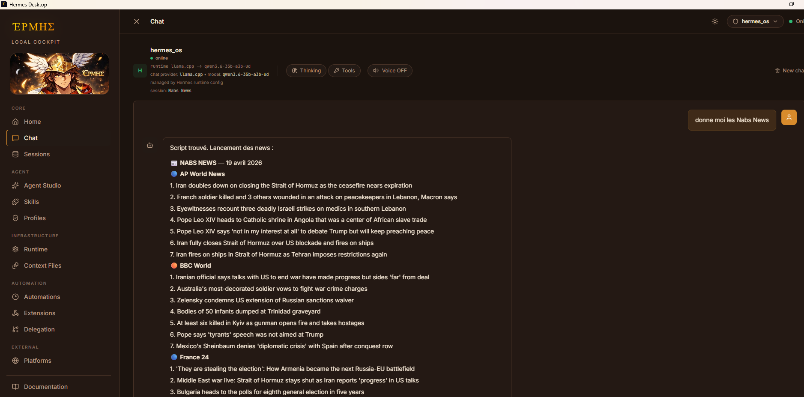
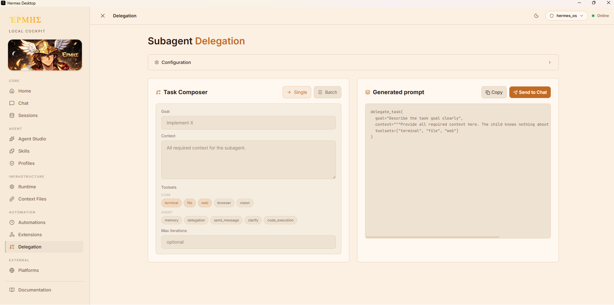

# Hermes Desktop

A local-first desktop environment for running and controlling Hermes AI agents on Windows.

<p align="center">
  
</p>

[](https://github.com/sunuai221-oss/Hermes-Desktop/actions/workflows/ci.yml)
[](LICENSE)

## What Is Hermes Desktop?

- A local-first control surface for Hermes on Windows.
- An Electron shell backed by a local Express service and a React UI served over `localhost`.
- A one-click entrypoint for gateway status, sessions, memory, configuration, hooks, skills, and automations.
- A desktop workflow that keeps the Hermes runtime in WSL while keeping Windows packaging and launchers local.
- A public product named `Hermes Desktop`, with a small number of legacy `builder` names preserved only for compatibility.

## Why This Exists

Hermes Desktop gives Hermes a repeatable local operator workflow on Windows. Instead of relying on ad hoc browser tabs, manual port handling, and one-off WSL commands, it provides a stable desktop entrypoint that stays close to the local runtime.

## Screenshots

### Chat interface

Main interaction view for working with Hermes agents in real time.



### Delegation system

Interface for orchestrating multi-agent workflows and task delegation.



## Platform Support

| Platform | Status | Notes |
| --- | --- | --- |
| Windows with WSL | Supported | Primary target and recommended setup. |
| Windows without WSL | Not supported for normal use | Hermes is expected to run inside WSL. |
| Native Linux desktop | Not packaged | Some code is portable, but launchers and packaging are Windows-first today. |

## Prerequisites

Required:

- Windows with WSL enabled and a working Linux distribution.
- A Hermes runtime and Hermes CLI available inside that WSL distribution.
- Node.js 22 or newer on Windows.
- `npm`, which ships with Node.js.

Optional:

- A canonical WSL worktree if you prefer to keep git history and day-to-day development on ext4.
- Browser mode if you want to inspect the same local UI without Electron.

If you develop from a canonical WSL worktree, use Node.js 22 or newer there as well.

## Quick Start (recommended)

For a fresh checkout on Windows:

```powershell
npm run setup
Copy-Item hermes-desktop.local.cmd.example hermes-desktop.local.cmd
```

Then update `hermes-desktop.local.cmd` only if your machine needs local overrides and keep it untracked.

Run the desktop application:

```bat
start-hermes-desktop.bat
```

For development mode:

```bat
start-hermes-desktop-dev.bat
```

`start-hermes-desktop.bat` is the default entrypoint. It checks Windows dependencies, verifies the Hermes gateway in WSL, builds the UI bundle if needed, and launches Hermes Desktop in Electron.

### Optional browser mode (legacy / compatibility)

Use only if you need browser-based access or legacy workflows.

```bat
start-builder.bat
```

For browser development:

```bat
start-builder-dev.bat
```

## Launcher Modes

Use the Electron launcher unless you explicitly want a browser-based workflow.

| Workflow | Script | When to use it |
| --- | --- | --- |
| Recommended desktop launch | `start-hermes-desktop.bat` | Default one-click entrypoint for normal use. |
| Desktop development | `start-hermes-desktop-dev.bat` | Runs Electron in development mode. |
| Optional browser mode | `start-builder.bat` | Starts the same local backend and opens the UI in a browser. |
| Browser development | `start-builder-dev.bat` | Uses the browser workflow with dev middleware. |

The `start-builder*.bat` launchers remain available for browser-first debugging and legacy-compatible workflows. They are optional and do not represent a separate product.

## Runtime Model

At a high level, Hermes Desktop follows this flow:

1. a Windows launcher loads optional local overrides and checks local dependencies
2. the launcher verifies that the Hermes gateway in WSL is reachable and starts it if needed
3. Electron starts or reuses the local backend on Windows
4. the backend serves the UI over `localhost` and manages Hermes runtime state and files

## Does Hermes Desktop depend on a web app?

No.

Hermes Desktop runs entirely locally. The Electron app starts (or reuses) a local backend, which serves the UI over HTTP.

There is no hosted frontend and no external dependency required.

Some internal paths and variables still use legacy `builder` naming for compatibility. These are internal implementation details only.

## Planned Improvements

The current roadmap focuses on a small number of practical engineering upgrades:

- split `server/index.mjs` into smaller route and service modules
- add automated smoke tests and targeted unit tests
- harden Windows packaging and release validation over time

See `docs/product-roadmap.md` for the broader direction.

## Repository Layout

- `src/`: React frontend
- `server/`: local Express backend and runtime orchestration
- `electron/`: Electron entrypoints
- `public/`: runtime static assets bundled with the UI
- `docs/`: product, workflow, and maintenance documentation
- `docs/screenshots/`: README screenshots
- `scripts/sync-to-windows.sh`: WSL-to-Windows mirror sync helper
- `start-*.bat`: Windows launchers
- `run-*.cmd`: supporting launcher scripts

## Configuration and Local Overrides

Do not edit committed launchers for machine-specific paths. Use a local override file instead.

Preferred setup:

1. copy `hermes-desktop.local.cmd.example` to `hermes-desktop.local.cmd`
2. set only the values your machine needs
3. keep `hermes-desktop.local.cmd` untracked

Most useful variables:

- `HERMES_WSL_DISTRO`
- `HERMES_CLI_PATH`
- `HERMES_WSL_HOME`
- `HERMES_HOME`
- `HERMES_GATEWAY_PORT`
- `HERMES_DESKTOP_PORT`
- `HERMES_DESKTOP_DEV_PORT`

Compatibility note:

- `hermes-builder.local.cmd` remains supported as a legacy override filename
- `hermes-builder.local.cmd.example` remains in the repository for older setups, but new setups should start from `hermes-desktop.local.cmd.example`
- some internal environment variables still use `HERMES_BUILDER_*`
- the local compatibility state directory remains `.hermes-builder/`

These names are compatibility bridges, not public branding.

## Development Workflow

The recommended working model is:

1. keep the canonical git repository in WSL on ext4
2. edit and commit there
3. sync to a Windows mirror when you need Electron packaging or launcher validation

Why this model is safer:

- Linux and Windows `node_modules` remain separate
- Electron Windows binaries stay on the Windows mirror
- the runtime environment stays close to the Hermes source of truth

Useful commands:

```powershell
npm run setup
npm run install:server
npm run lint
npm run build
npm run check
```

## Known Limitations

- Windows-first. Linux and macOS are not fully supported yet.
- Requires a working WSL setup and a Hermes runtime inside the configured distribution.
- No published installer release yet. The current workflow still relies on manual launch scripts.

## Troubleshooting

Common issues on a fresh setup:

- `electron.exe` is missing or the launcher reports a Linux Electron binary: run `npm run setup` in the Windows working tree.
- The backend fails with missing Node modules: run `npm run install:server` or `npm run setup`.
- The gateway does not start from Windows: verify `HERMES_WSL_DISTRO`, `HERMES_CLI_PATH`, and that the Hermes CLI works inside WSL.
- You see `builder` names in logs, config, or health routes: that is expected compatibility naming, not a second product.
- You only want to inspect the UI in a browser: use `start-builder.bat` instead of the Electron launcher.

For more detail, see `docs/troubleshooting.md`.

## Documentation

- `docs/desktop-electron.md`
- `docs/troubleshooting.md`
- `docs/repository-notes.md`
- `docs/product-roadmap.md`
- `docs/wsl-windows-workflow.md`
- `CONTRIBUTING.md`
- `SECURITY.md`
- `CODE_OF_CONDUCT.md`

## License

MIT. See `LICENSE`.
