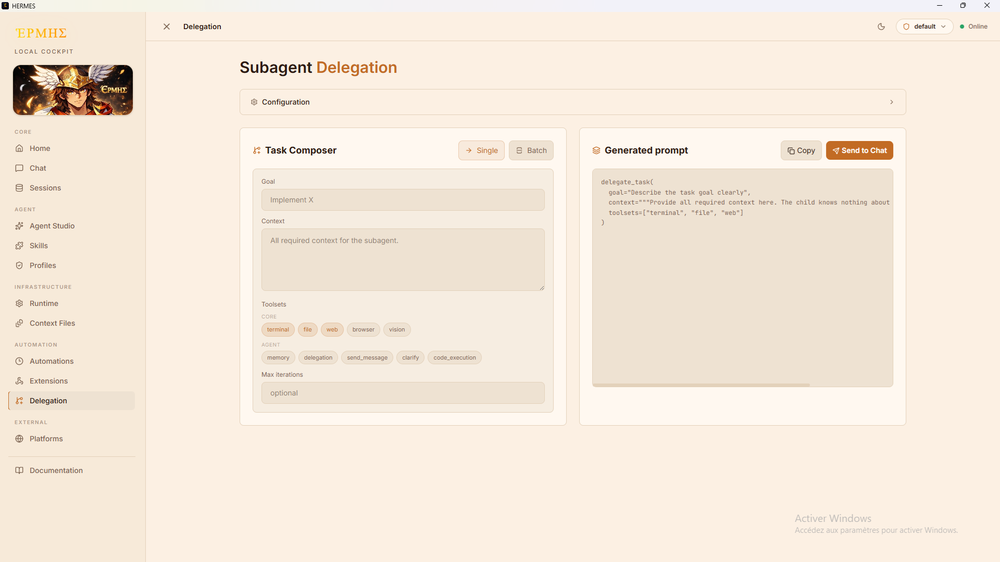

# Hermes Desktop

[](https://github.com/sunuai221-oss/Hermes-Desktop/actions/workflows/ci.yml)
[](LICENSE)

Hermes Desktop is a Windows-first Electron application for operating a Hermes runtime hosted in WSL. It combines a local React + Vite interface, a local Express backend, an Electron shell, and Windows/WSL launchers into one local operator workflow.

## What It Does

- Starts or reconnects to a Hermes gateway running inside WSL.
- Exposes the same local UI through Electron or, optionally, through a browser.
- Reads and edits Hermes runtime files such as `config.yaml`, `SOUL.md`, memories, hooks, skills, and sessions.
- Keeps Windows desktop packaging separate from the WSL runtime environment.
- Preserves backward compatibility with older `builder` names where existing scripts or state still depend on them.

## Screenshots

### Chat Workspace


### Delegation Workspace



## Platform Support

| Platform | Status | Notes |
| --- | --- | --- |
| Windows with WSL | Supported | Primary target and recommended setup. |
| Windows without WSL | Not supported for normal use | The Hermes runtime is expected to run inside WSL. |
| Native Linux desktop | Not packaged | The codebase is portable in parts, but launchers and packaging are Windows-first today. |

## How It Works

At a high level, Hermes Desktop follows this flow:

1. A Windows launcher loads optional local overrides and checks local dependencies.
2. The launcher verifies that the Hermes gateway in WSL is reachable and starts it if needed.
3. Electron starts or reuses the local backend on Windows.
4. The backend serves the UI over `localhost` and manages Hermes runtime state and files.

### Does Electron depend on a separate web app?

No. Hermes Desktop runs as a single local application. The Electron shell starts or reconnects to the local backend, and that backend serves the UI over `localhost`. There is no separate hosted frontend to deploy.

Some internal routes, environment variables, and local state folders still use historical `builder` names. Those names are kept for backward compatibility and should be treated as internal compatibility details rather than a separate product.

## Installation

### Prerequisites

Before you launch the app, make sure you have:

- Windows with WSL enabled and a working Linux distribution.
- A Hermes runtime and Hermes CLI available inside that WSL distribution.
- Node.js 22 or newer on Windows.
- `npm`, which ships with Node.js.

If you develop from a canonical WSL worktree, use Node.js 22 or newer there as well.

### Fresh Clone Setup

From the repository root on Windows:

```powershell
npm run setup
Copy-Item hermes-desktop.local.cmd.example hermes-desktop.local.cmd
```

Then update `hermes-desktop.local.cmd` for your machine.

`npm run setup` installs both the root dependencies and the backend dependencies under `server/`. This is the safest starting point for a fresh clone.

## Quick Start

For normal use, run:

```bat
start-hermes-desktop.bat
```

What this launcher does:

- checks for Windows Electron dependencies
- verifies the Hermes gateway in WSL
- builds the frontend bundle if needed
- launches Hermes Desktop in Electron

## Desktop Mode vs Optional Browser Mode

Use the Electron launcher unless you explicitly want a browser-based workflow.

| Use case | Script | Notes |
| --- | --- | --- |
| Standard desktop launch | `start-hermes-desktop.bat` | Recommended for normal use. |
| Desktop development | `start-hermes-desktop-dev.bat` | Runs Electron in development mode. |
| Optional browser launch | `start-builder.bat` | Starts the same local backend and opens the UI in a browser. Electron is not required. |
| Browser development | `start-builder-dev.bat` | Starts the backend with Vite middleware and opens the browser UI. |

The `start-builder*.bat` scripts remain available because they are useful for browser-first debugging and older workflows. They are optional. The public product name is still Hermes Desktop.

## Repository Layout

- `src/`: React frontend
- `server/`: local Express backend and runtime orchestration
- `electron/`: Electron entrypoints
- `public/`: runtime static assets bundled with the UI
- `docs/`: product, workflow, and maintenance documentation
- `docs/screenshots/`: README screenshots
- `scripts/sync-to-windows.sh`: WSL-to-Windows mirror sync helper
- `start-*.bat`: Windows launchers
- `run-*.cmd`: supporting launcher scripts

## Configuration and Local Overrides

Do not edit committed launchers for machine-specific paths. Use a local override file instead.

Preferred setup:

1. Copy `hermes-desktop.local.cmd.example` to `hermes-desktop.local.cmd`
2. Set only the values your machine needs
3. Keep `hermes-desktop.local.cmd` untracked

Useful variables:

- `HERMES_WSL_DISTRO`
- `HERMES_CLI_PATH`
- `HERMES_WSL_HOME`
- `HERMES_HOME`
- `HERMES_GATEWAY_PORT`
- `HERMES_DESKTOP_PORT`
- `HERMES_DESKTOP_DEV_PORT`

Compatibility note:

- older setups may still use `hermes-builder.local.cmd`
- some internal environment variables still use `HERMES_BUILDER_*`
- the local compatibility state directory remains `.hermes-builder/`

These names are intentional compatibility bridges. New documentation and user-facing text prefer `Hermes Desktop`.

## Development Workflow

The recommended working model is:

1. keep the canonical git repository in WSL on ext4
2. edit and commit there
3. sync to a Windows mirror when you need Electron packaging or launcher validation

Why this model is safer:

- Linux and Windows `node_modules` remain separate
- Electron Windows binaries stay on the Windows mirror
- the runtime environment stays close to the Hermes source of truth

Useful commands:

```powershell
npm run setup
npm run install:server
npm run lint
npm run build
npm run check
```

## Troubleshooting

Common issues on a fresh setup:

- `electron.exe` is missing or the launcher reports a Linux Electron binary: run `npm run setup` in the Windows working tree.
- The backend fails with missing Node modules: run `npm run install:server` or `npm run setup`.
- The gateway does not start from Windows: verify `HERMES_WSL_DISTRO`, `HERMES_CLI_PATH`, and that the Hermes CLI works inside WSL.
- You see `builder` names in logs, config, or health routes: that is expected compatibility naming, not a second product.
- You only want to inspect the UI in a browser: use `start-builder.bat` instead of the Electron launcher.

For more detail, see `docs/troubleshooting.md`.

## Documentation

- `docs/desktop-electron.md`
- `docs/troubleshooting.md`
- `docs/repository-notes.md`
- `docs/product-roadmap.md`
- `docs/wsl-windows-workflow.md`
- `CONTRIBUTING.md`
- `SECURITY.md`

## License

MIT. See `LICENSE`.
